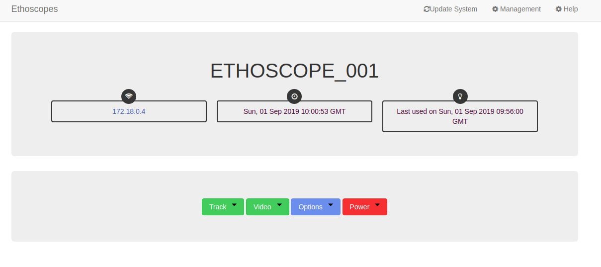

# Ethoscope Docker image


A set of images that port the ethoscope framework to Docker for easy deployment and testing of new features

## How to run

* Create a Docker network `ethoscope-net` where all the containers will run
* Spin up a mysql server with user and password root
* Spin up a node server running the `server.py`and `backup_tool.py`. The server running on container's port 80 will be randomly mapped to a host port.
* Spin up an ethoscope server

All these steps are achieved by running:

```
./run.sh
```

Then run
```
docker port node 80
```

and browse the resulting URL


Then you can click on ETHOSCOPE_001



Select the MovieVirtualCamera class to analyze a video inside the ethoscope


Tracking starts normally.


The resulting db file can be downloaded by clicking on the blue link above the image. It is also available inside the results folder in the same directory as `run.sh`.


If you want to repeat the process, the ethoscope container must be restarted!!

```
docker restart ETHOSCOPE_001
```

## TODO

- Write a smarter docker-compose implementation of run.sh
- Choose videos
- Support real world ethoscopes. Maybe they can be manually added with `DeviceScanner.add()`?
