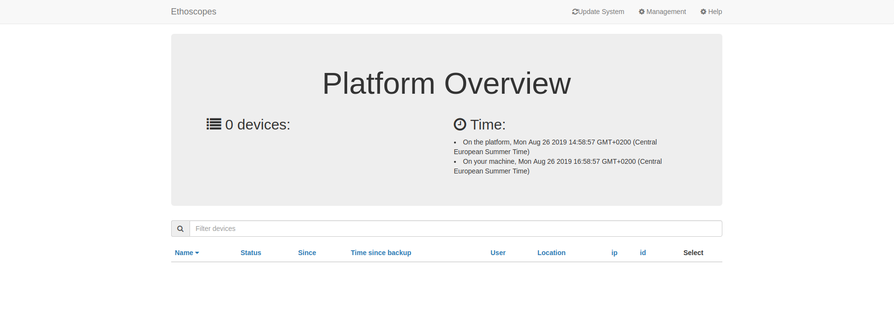

# Ethoscope Docker image


A set of images that port the ethoscope framework to Docker for easy deployment and testing of new features

## How to run

```
# Spin up a container for the node and run the appropriate services
# If the exec command fails, the container is stopped and removed automatically (thanks to --rm and docker stop node)
docker run -dP --rm  --privileged -v /sys/fs/cgroup:/sys/fs/cgroup:ro --name node  node && docker exec node /root/startup.sh || docker stop node

# Check which host port is mapped to port 80
docker ps

# returns an output that looks like this
# aaba52d288ef        ethoscope           "/lib/systemd/systemd"   5 minutes ago       Up 5 minutes        0.0.0.0:32770->80/tcp   ethoscope
# it tells us that the container's port 80 has been mapped to host port 32770
```
Open Chrome and navigate to the IP+Port address shown in the output of docker docker ps, in this case [0.0.0.0:32770](0.0.0.0:32770)
You should get an emtpy ethoscope table.

 


If you then run:

```
docker run -dP --rm  --privileged -v /sys/fs/cgroup:/sys/fs/cgroup:ro --name ETHOSCOPE_001 ethoscope && docker exec ETHOSCOPE_001 /root/startup.sh  || docker stop ETHOSCOPE_001
```

A new ethoscope should pop up (maybe after refreshing).


## TODO

1. Enable record/tracking from video with the `MovieVirtualCamera` class.


2. Fix MySQL error

```
Aug 28 12:33:11 dd4a76fb6c46 python[210]: mysql.connector.errors.ProgrammingError: 1049 (42000): Unknown database 'ethoscope_db'
Aug 28 12:33:11 dd4a76fb6c46 python[210]:     sqlstate=exc.sqlstate)
Aug 28 12:33:11 dd4a76fb6c46 python[210]:   File "/usr/lib/python3.7/site-packages/mysql/connector/connection_cext.py", line 203, in _open_connection
Aug 28 12:33:11 dd4a76fb6c46 python[210]:     self._open_connection()
Aug 28 12:33:11 dd4a76fb6c46 python[210]:   File "/usr/lib/python3.7/site-packages/mysql/connector/abstracts.py", line 780, in connect
Aug 28 12:33:11 dd4a76fb6c46 python[210]:     self.connect(**kwargs)
Aug 28 12:33:11 dd4a76fb6c46 python[210]:   File "/usr/lib/python3.7/site-packages/mysql/connector/connection_cext.py", line 80, in __init__
Aug 28 12:33:11 dd4a76fb6c46 python[210]:     return CMySQLConnection(*args, **kwargs)
Aug 28 12:33:11 dd4a76fb6c46 python[210]:   File "/usr/lib/python3.7/site-packages/mysql/connector/__init__.py", line 172, in connect
Aug 28 12:33:11 dd4a76fb6c46 python[210]:     buffered=True)
Aug 28 12:33:11 dd4a76fb6c46 python[210]:   File "/opt/ethoscope-git/node_src/ethoscope_node/utils/device_scanner.py", line 459, in _make_backup_path
Aug 28 12:33:11 dd4a76fb6c46 python[210]: Traceback (most recent call last):
Aug 28 12:33:11 dd4a76fb6c46 python[210]: During handling of the above exception, another exception occurred:
Aug 28 12:33:11 dd4a76fb6c46 python[210]: _mysql_connector.MySQLInterfaceError: Unknown database 'ethoscope_db'
Aug 28 12:33:11 dd4a76fb6c46 python[210]:     self._cmysql.connect(**cnx_kwargs)
Aug 28 12:33:11 dd4a76fb6c46 python[210]:   File "/usr/lib/python3.7/site-packages/mysql/connector/connection_cext.py", line 200, in _open_connection
Aug 28 12:33:11 dd4a76fb6c46 python[210]: ERROR:root:Traceback (most recent call last):
Aug 28 12:33:11 dd4a76fb6c46 python[210]: ERROR:root:Could not generate backup path for device. Probably a MySQL issue
 
```
